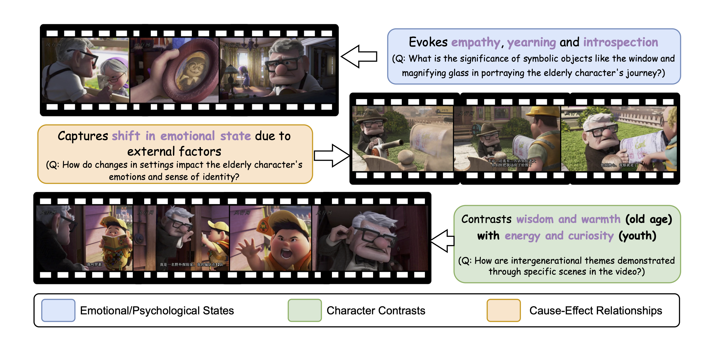

# MovieCore

MovieCORE is a video question answering (VQA) dataset designed to probe deeper cognitive understanding of movie content.



For more details, please refer to our [paper](https://openreview.net/pdf/6e5cff66a888f3fecba9415dbf4048d119f3f59f.pdf).

## Data Preparation

Please download the videos from MovieChat's HF repos. [Training Data](https://huggingface.co/datasets/Enxin/MovieChat-1K_train) and [Test Data](https://huggingface.co/datasets/Enxin/MovieChat-1K-test). Extract them as fits your model and use our [annotations](https://huggingface.co/datasets/MovieCORE/MovieCORE/tree/main).

## Run some baselines
Coming soon

## Evaluation Dimensions

The evaluation is performed across the following dimensions:
- **Accuracy**: Measures the semantic similarity between the predicted answer and the ground truth.
- **Comprehensiveness**: Assesses whether the predicted answer covers all key aspects mentioned in the ground truth.
- **Depth**: Evaluates the level of reasoning and insight demonstrated in the predicted answer.
- **Evidence**: Checks the quality and relevance of evidence provided in the predicted answer.
- **Coherence**: Measures the logical flow, organization, and clarity of the predicted answer.

## Usage

To evaluate the MovieCore dataset, use the `evaluate_moviecore.py` script. The script processes the dataset, evaluates each QA pair across the specified dimensions, and calculates overall and classification-specific scores.

### Running the Evaluation

```bash
export OPENAI_API_KEY='sk******'
python evaluate_moviecore.py --pred_path path/to/your/predictions.json
```

### Input Format

```json
{
    "video_1.mp4": [
        {
            "question": "How does the video depict the unique adaptations of the species in the Sahara Desert, and what roles do these species play in their ecosystem?",
            "answer": "The GT answer.",
            "pred": "Your pred.",
            "classification": "the classification"
        },
        {
            "question": "The second question of video 1?",
            "answer": "The GT answer.",
            "pred": "Your pred.",
            "classification": "the classification"
        }
    ],
    "video_2.mp4": [
        {
            "question": "The only question of video 2",
            "answer": "The GT answer.",
            "pred": "Your pred.",
            "classification": "the classification"
        }
    ]
}
```

### License
This dataset is provided under the MIT License.